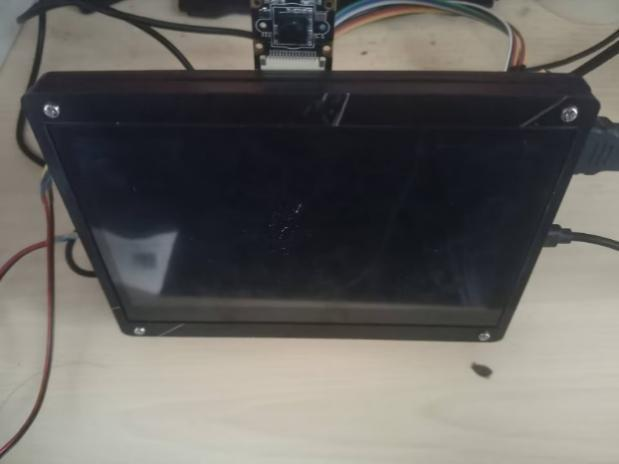
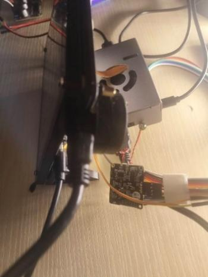
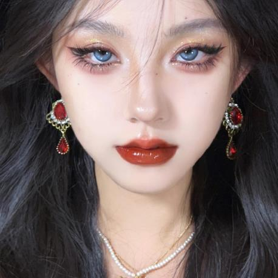
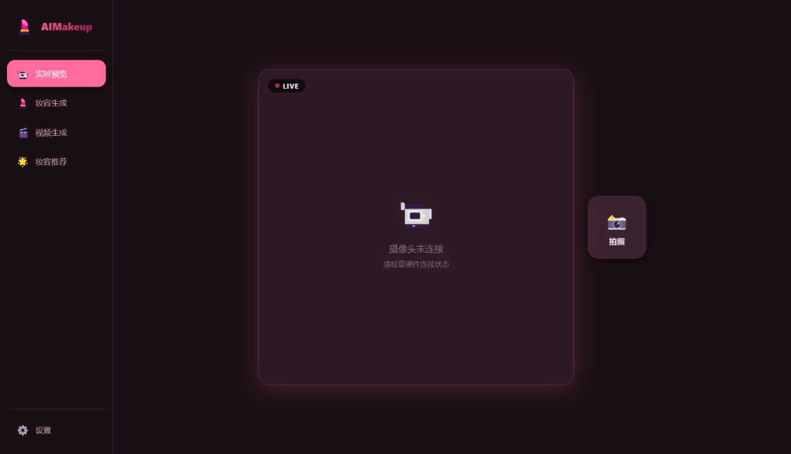
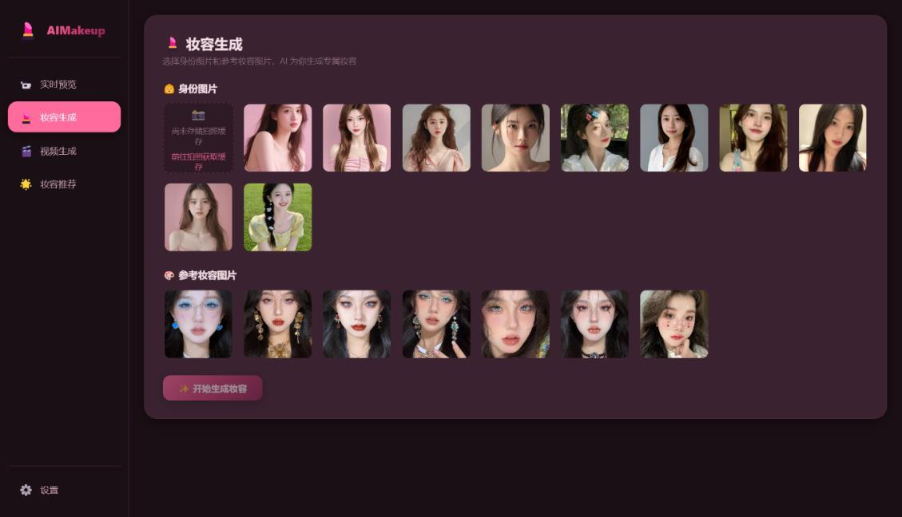
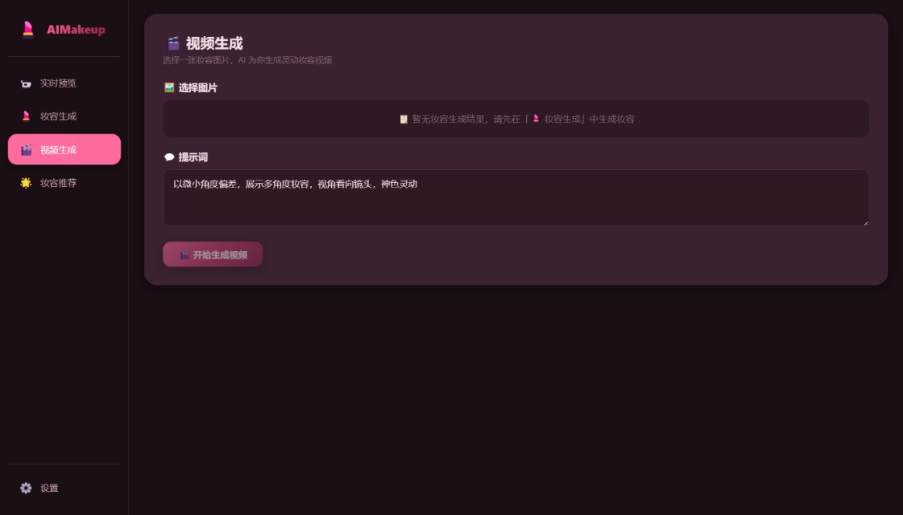
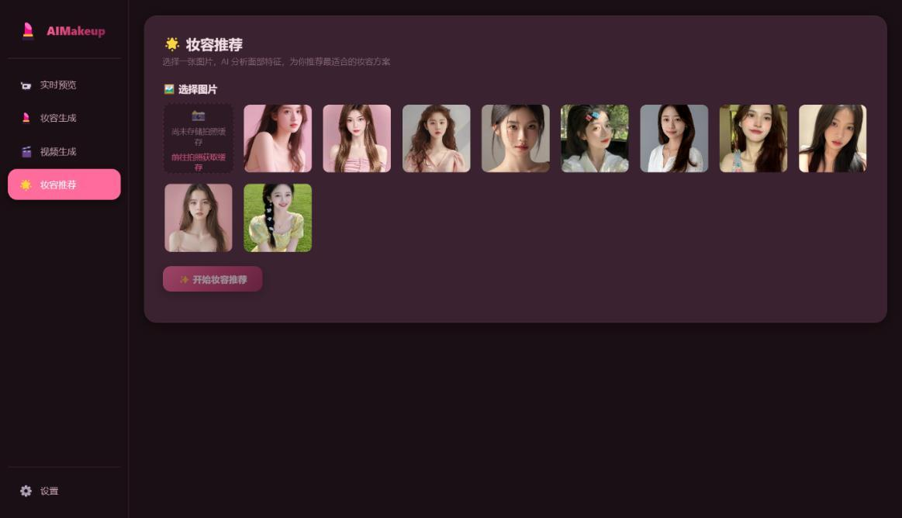
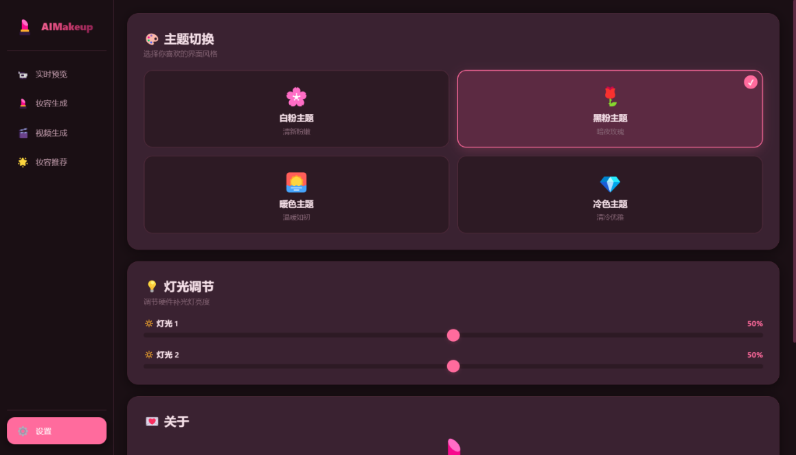
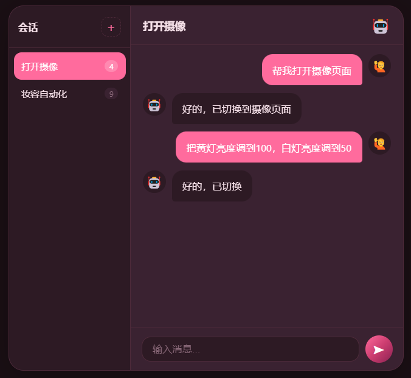
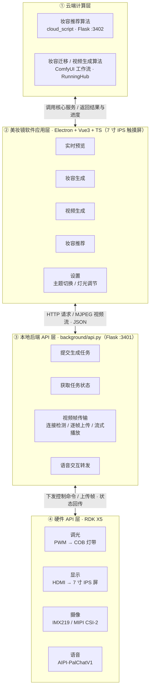

# AIMakeup 美妆镜

> 一面会「化妆」的镜子 —— 拍摄人脸，AI 实时生成专属妆容、动态视频，并给出个性化的妆容推荐方案。

AIMakeup 是一个**端云协同**的智能美妆镜系统，硬件以 **RDK X5** 开发板为控制核心：以 **IMX219** 800 万像素摄像头采集人脸，**7 寸 IPS 触摸屏**承载交互界面，双色温 **COB 灯带**提供补光，**AIPI-PalChatV1** 语音模块实现免触控操作。软件侧，Electron 桌面端提供交互界面，本地后端 API 承担任务调度与视频流转发，云端承载妆容推荐大模型与 ComfyUI 生成工作流。系统融合双编码路径与大语言模型实现个性化妆容推荐，采用两轮扩散生成策略实现高保真妆容迁移，并基于 Wan2.2 级联采样把静态试妆图转换为动态视频。

> 本文档对应论文《基于多模态深度学习的妆容迁移美妆镜设计》（谭薪峻，无锡学院集成电路科学与工程学院），全文见 [`论文.pdf`](./论文.pdf)。

### 实物与效果

系统实物（论文图 5-1）与妆容迁移前后效果（论文图 5-9、5-10）：

| 实物 · 主视图 | 实物 · 右视图 |
| --- | --- |
|  |  |

**效果 1** —— 粉色系妆容迁移：

| 美妆前 | 参考妆容 | 美妆后 |
| --- | --- | --- |
|  |  |  |

**效果 2** —— 红色系妆容迁移：

| 美妆前 | 参考妆容 | 美妆后 |
| --- | --- | --- |
|  |  |  |

### 界面预览

| 实时预览 | 妆容生成 |
| --- | --- |
|  |  |
| **视频生成** | **妆容推荐** |
|  |  |

| 设置页面 | 语音助手 |
| --- | --- |
|  |  |

---

## 目录

- [系统架构](#系统架构)
- [功能特性](#功能特性)
- [核心算法设计](#核心算法设计)
- [硬件平台](#硬件平台)
- [项目结构](#项目结构)
- [环境要求](#环境要求)
- [Windows 部署](#windows-部署)
- [Linux 部署](#linux-部署)
- [云端部署（妆容推荐脚本）](#云端部署妆容推荐脚本)
- [ComfyUI 工作流](#comfyui-工作流)
- [边缘设备说明](#边缘设备说明)
- [接口一览](#接口一览)
- [配置说明](#配置说明)
- [常见问题](#常见问题)
- [文档与论文](#文档与论文)

---

## 系统架构

系统基于「云端计算 + 本地渲染」的设计理念，充分利用云端大模型的算力与边缘端设备的低时延特性。软件架构自上而下分为**云端计算层、美妆镜软件应用层、本地后端 API 层、硬件 API 层**四个功能层级（论文图 4-1）：应用层向上调用云端的妆容推荐、妆容迁移、视频生成三项核心服务，向下经本地后端 API 层与各硬件模块交互。



任务流转：应用层上传「身份图 + 参考妆容图」→ 本地后端经 RunningHub 转存并创建任务 → 应用层每秒轮询状态并在界面显示进度 → 完成后回传结果图/视频地址。视频帧另有独立通路：摄像头 → 本地后端 `frame_store` → 应用层 MJPEG 流播放。

---

## 功能特性

| 模块 | 说明 |
| --- | --- |
| 📷 **实时预览** | 展示边缘设备 1024×1024 的 MJPEG 视频流，支持一键拍照并缓存当前帧作为身份图 |
| 💄 **妆容生成** | 选择「身份图」（拍照缓存或内置 A 类样图）+「参考妆容图」（内置 B 类样图），生成融合妆容 |
| 🎬 **视频生成** | 从本次会话中已生成的妆容结果里选一张作为输入，配合提示词生成多角度展示视频 |
| 🤖 **妆容推荐** | 上传人脸，云端大模型分析面部特征与肤色，输出底妆/眼妆/唇妆/修容的定制方案（带进度流） |
| ⚙️ **设置** | 四套主题（白粉 / 黑粉 / 暖色 / 冷色）切换、硬件双补光灯亮度调节、关于信息 |
| 🗣️ **语音控制** | 经 AIPI-PalChatV1 语音模块与云端 MCP 服务器配合，用自然语言完成换妆、调光、页面切换。唤醒词「你好小安」，长时间无指令自动进入待机 |

桌面端为无边框菜单栏（`autoHideMenuBar`）、窗口最小尺寸 850×500，并全局关闭 `webSecurity` 以允许跨域访问本地后端。

---

## 核心算法设计

### 妆容推荐：双编码路径 + 大语言模型

推荐算法的目标是给定一张人脸照片，自动生成个性化妆容推荐的文字方案。输入先做下采样与平铺，得到 3×224×224 张量后送入两个并行分支，各自提取特征：

**纹理编码块**捕捉人脸纹理细节：图像经 VAE 编码器压缩到潜空间，得到低维潜向量；该向量通过交叉注意力（Cross-Attention）与语义分支输出做跨模态对齐，使纹理特征与高阶语义关联；对齐后经门控注意力融合模块（Gated Fusion）自适应加权组合，由网络自动决定纹理与语义的最优权重比；最终映射为视觉编码（Visual Tokens），成为大语言模型可接受的视觉输入。

**语义编码块**关注高层次语义：以 **CLIP-ViT-L/14** 提取语义化特征，细分出两组表示 —— 面部整体肤色与风格、以及眼部/嘴唇/脸颊等部位的具体属性。

**辅助分类约束**为提升语义特征判别性，在综合特征上接入辅助分类器进行两个子任务：妆容风格分类（**6 类**：日常淡妆、职场通勤、约会甜美、派对烟熏、复古港风、清透裸妆）与肤色分类（**5 类**：冷白皮、暖白皮、自然肤色、健康小麦色、深肤色）。两组结果以有序形式给出，为后续大模型提供类别先验知识。

**大语言模型生成**：视觉编码与辅助分类提示词一并输入 LLM-Adapter，将视觉特征与分类先验映射到大模型可理解的嵌入空间，再传入文本生成器自回归产生推荐结果，输出妆容风格建议、具体产品色号推荐与搭配方案。

对应实现见 `cloud_script/recommend.py`：`VitFeatureExtractor`（语义分支）、`MakeupVAE`（纹理分支）、`FeatureFusion`（交叉注意力 + 门控融合）、`MakeupRecommendationModel.generate_recommendation`（LLM 生成）。

### 妆容生成：两轮扩散迁移

目标是在给定参考妆容图的基础上，把妆容效果转移到用户脸上，同时保持身份一致性。整个过程分四步（论文图 4-8 ~ 4-11）：

1. **模型预处理** —— 以 **Z-Image** 为生成骨干网络，并在 LoRA 真实风格模型上微调以减少扩散模型常见的过拟合或过度艺术化；DW 姿态预处理器做人脸关键点检测与姿态估计，结构化信息送入 AUX 集成预处理器融合，再由风格提取器获取妆容风格表示并以采样偏移方式传给偏移模型；CLIP 加载器初始化文本编码器，把妆容描述文本编码为语义向量作为采样指导条件。
2. **一次妆容生成** —— 在 **StableMakeup** 妆容迁移扩散模型上进行。输入两张图：身份照片提供面部形状与身份信息并作为结构约束，妆容样本提供颜色/纹理/风格并作为指导原则；在潜空间完成妆容特征跨域转移，得到初生成图像。此时基本达到预期妆容效果，但面部边缘与原始身份图衔接不够平滑。
3. **身份融合** —— 对初生成图与原始身份图分别做人像分割得到两张遮罩，经 ALPHA 融合加权混合，确定妆容部分与原始身份部分的过渡权重分配；融合结果上采样提高清晰度后送入 VAE 编码器压缩为一次潜空间向量，作为第二次生成的初始潜空间表示。
4. **二次妆容生成** —— K 采样器接收三个输入：偏移模型给出的**风格偏置**、CLIP 文本编码器的**指导信息**、以及**潜空间向量**（作为去噪起点）。多次去噪后产生新的潜空间向量，经 VAE 解码器转换为像素级图像，即最终妆容迁移结果。

对应工作流见 `comfyui/妆容生成.json`。

### 视频预览：Wan2.2 高噪-低噪级联采样

静态试妆图到动态视频采用两阶段级联采样（论文图 4-12、4-13）：

- **模型预处理** —— Wan2.2 高噪与低噪视频生成模型分别经 UNET 加载器加载权重，并各自匹配 LoRA 真实风格微调权重；CLIP 加载器初始化文本编码器，将视频内容描述文本转为语义向量作为采样条件。
- **第一阶段（高噪）** —— 以上一步妆容迁移结果图经 VAE 编码得到的潜向量为起点，在高噪模型下做高噪声水平扩散去噪，主要生成视频的时间顺序，即帧间位置移动与姿态变化方向。
- **第二阶段（低噪）** —— 第一阶段结果送入第二个采样网络，在低噪模型控制下进一步去噪，主要提升单帧质量（皮肤细腻程度、妆容颜色准确性）与帧间平滑度。

两阶段结束后，细化后的潜向量经 VAE 解码器恢复为像素空间，得到连续视频序列帧。相比单阶段采样，级联方式在提速的同时改善了生成质量与帧间一致性。

对应工作流见 `comfyui/视频生成.json`。

---

## 硬件平台

系统的硬件组合为：**RDK X5 主控 + IMX219 摄像头 + 7 寸 IPS 触摸屏 + 双色温 COB 灯带 + AIPI-PalChatV1 语音模块**。所有外设围绕 RDK X5 布置，经转接板与排线连接，通过 MIPI、HDMI、UART、GPIO 等接口接入主控，构成端云结合的整体控制系统。

| 模块 | 选型 | 关键参数与选型理由 |
| --- | --- | --- |
| **主控** | RDK X5 | 2.0 GHz 主频；集成 BPU 神经网络加速器，最高 10 TOPS INT8 推理；搭载 Linux 可部署深度学习推理程序；具备 USB / HDMI / 以太网 / GPIO / I2C / SPI / UART 等接口。对比方案 **ESP32-S3** 因无法运行 Linux、不能部署推理程序而落选 |
| **摄像** | **IMX219** | 800 万像素 CMOS，1/4″ 背照式；最高 3280×2464 拍照、60 fps@720p；双通道 MIPI CSI-2；自动曝光与自动白平衡。对比方案 **OV5640**（500 万像素，支持自动对焦与硬件 JPEG 编码）在成像质量上处于劣势而落选 |
| **显示** | 7 寸 IPS 触摸屏 | 近 178° 大可视角度，用户在不同位置都能看清妆效；色域覆盖好，能准确区分不同色号唇膏、眼影过渡与腮红色泽。HDMI 连接主控，触控经 USB 回传，独立电源适配器供电 |
| **照明** | COB 灯带 | 芯片高密度贴装，发光连续均匀，避免传统灯珠灯带的「颗粒感」与「光斑」；显色度高，可真实还原口红/眼影/粉底的细微色差；支持 PWM 无极调光（0%–100%），低亮度下仍保证色温一致性。黄色与白色两种色温分别接 **PWM6 / PWM7** 引脚混合调节，工作电压 3.3 V |
| **语音** | AIPI-PalChatV1 | 小安大模型在线语音交互模块。相较离线语音识别模块，借助云端大模型语义理解能力，可识别同义词、口语化表达及省略指代，鲁棒性更好。麦克风阵列拾音 → ADC 转换 → 降噪消回声 → Wi-Fi 送至 MCP 服务器 → 云端 LLM 语义分析 → 返回文本 → TTS 合成语音播放 |

### 硬件连接方式

| 外设 | 接口 | 供电 |
| --- | --- | --- |
| IMX219 摄像头 | FPC 排线接 **CSI** 接口，经 **I2C** 配置传感器寄存器（分辨率 / 帧率 / 曝光） | RDK X5 板载集成电源 |
| 7 寸 IPS 触摸屏 | 显示信号走 **HDMI**，触控数据走 **USB** | 独立电源适配器 |
| COB 灯带（黄 / 白） | PWM 控制端接 **GPIO**（PWM6 / PWM7） | 3.3 V 直流 |
| AIPI-PalChatV1 | 麦克风阵列 + **Wi-Fi** 连接 MCP 服务器 | 模块自带 |

### 语音控制

语音模块拾音后经 ADC 转为数字信号，降噪与消除回声后通过 Wi-Fi 送至 MCP 服务器，由云端大语言模型完成语义分析与意图判断，结果以文本返回，模块再用 TTS 合成语音播报。支持的指令包括切换页面、调节灯光亮度、触发拍照与妆容推荐等，唤醒词为「你好小安」（模块应答「我在」）；长时间无指令时播报「我退下」并进入待机。

实测中，一条「请把黄灯亮度调到 100，白灯亮度调到 50」的指令可同时改变两路灯光进度条；长流程指令（如「3 秒后拍照，然后妆容推荐，再妆容迁移」）也能被正确解析为多步操作并依次执行（论文图 5-13、5-14、5-15）。

---

## 项目结构

```
aimirror2/
├── src/                     # Electron + Vue3 桌面端源码
│   ├── electron/
│   │   ├── main/main.ts     # 主进程：创建窗口、文件选择 IPC
│   │   └── preload/preload.ts
│   ├── components/          # 五个页面组件
│   │   ├── CameraView.vue      # 实时预览 + 拍照
│   │   ├── MakeupGen.vue       # 妆容生成
│   │   ├── VideoGen.vue        # 视频生成
│   │   ├── RecommendView.vue   # 妆容推荐
│   │   ├── SettingsView.vue    # 主题 / 调光 / 关于
│   │   └── VoiceAssistant.vue  # 悬浮语音助手
│   ├── services/api.ts      # 全部后端接口封装（BASE 地址在此修改）
│   ├── store/app.ts         # Pinia：主题、拍照缓存、生成历史、灯光值
│   ├── router/index.ts      # hash 路由
│   └── styles/              # 主题变量与全局样式
├── background/              # ⚙️ 本地（边缘）后端 API
│   ├── api.py               # Flask 服务，默认 0.0.0.0:3401
│   ├── camera.py            # RDK X5 摄像头取流 → JPEG 推送
│   └── cache/               # 运行期缓存（input/、makeup_img/、makeup_video/、output/）
│       └── makeup_img/      # 妆容生成结果 <task_id>.jpg；视频结果直接走上游 fileUrl
├── cloud_script/            # ☁️ 云端妆容推荐脚本
│   ├── api.py               # Flask 流式接口，默认 0.0.0.0:3402
│   └── recommend.py         # 双编码路径 + LLM 妆容推荐模型与推理
├── comfyui/                 # 🎨 ComfyUI 工作流导出
│   ├── 妆容生成.json         # 妆容融合工作流（Z-Image-Turbo + 蒙版融合）
│   └── 视频生成.json         # 图生视频工作流（Wan2.2 I2V 14B，双采样器）
├── doc/                     # 📄 相关文档
│   ├── api.md               # 本地与云端 API 定义
│   ├── 提示词.txt            # 需求描述与生成提示词
│   ├── 软件安装.txt          # deb 打包 / 镜像源 / 字体安装记录
│   ├── Docker环境.txt        # electronuserland/builder 容器构建命令
│   ├── Electron安装流程.txt   # 项目脚手架搭建流程
│   └── Ubuntu环境安装流程.txt # WSL2 环境准备（systemd / DNS / locate）
├── public/ref/              # 构建期随包分发的样例图：a*.jpg 身份图（A 类）、b*.jpg 参考妆容图（B 类）
├── ref/                     # 后端 /ref/<path> 静态图目录（与 public/ref 同源，独立存放）
├── 论文.pdf                  # 📑 项目相关论文
├── package.json             # Windows 打包配置（electron-builder --win --x64）
└── package_linux.json       # Linux 打包配置（--linux --arm64，含 electronDist）
```

---

## 环境要求

| 组件 | 版本 / 说明 |
| --- | --- |
| Node.js | ≥ 16（推荐 18 LTS） |
| 包管理器 | npm 或 yarn（仓库同时含 `package-lock.json` 与 `yarn.lock`） |
| Electron | 打包配置指定 `electronVersion: 40.6.1`；开发依赖安装的是 `^25.3.2` |
| Python | ≥ 3.9，用于 `background/` 与 `cloud_script/` |
| 云端 GPU | 妆容推荐需 CUDA 环境（`recommend.py` 默认 `device="cuda"`） |

桌面端依赖（见 `package.json`）：`vue@3`、`pinia`、`vue-router@4`、`vite@2`、`typescript@4`、`electron`、`electron-builder`、`concurrently`。

---

## Windows 部署

### 1. 拉取代码并安装依赖

```powershell
git clone <your-repo-url> aimirror2
cd aimirror2
npm install
```

### 2. 启动本地后端（边缘 API）

```powershell
cd background
pip install flask flask-cors requests
python api.py
```

服务监听 `0.0.0.0:3401`。启动前请确认 `background/cache/` 下存在 `input/`、`makeup_img/`、`makeup_video/`、`output/` 目录（缺失时服务端会在写入结果时按需创建，`cache/input` 需手工创建）。

### 3. 启动云端推荐服务（可选）

妆容推荐功能依赖云端 3402 服务，详见 [云端部署](#云端部署妆容推荐脚本)。若不需要该功能，可跳过并在 `src/services/api.ts` 中忽略 `CLOUD_BASE`。

### 4. 开发调试

```powershell
npm run app:dev
```

该命令等价于 `tsc && concurrently vite "electron ." "tsc -w"`：Vite 起在 `3000` 端口，Electron 自动加载 `http://localhost:3000` 并打开 DevTools。

### 5. 打包 Windows 安装包

```powershell
npm run app:build
```

等价于 `npm run vite:build && tsc && electron-builder --win --x64`，产物为 NSIS 安装程序，输出到 `release/${version}/`，命名格式 `${productName}_${version}.exe`。

| 配置项 | 值 |
| --- | --- |
| `appId` | `YourAppID`（**发布前请改成自己的 ID**） |
| `asar` | `true` |
| `win.target` | `nsis` / `x64` |
| `nsis.oneClick` | `false`（非一键安装） |
| `nsis.perMachine` | `false`（按用户安装） |
| `nsis.allowToChangeInstallationDirectory` | `true` |
| `nsis.deleteAppDataOnUninstall` | `false` |

### 6. 仅预览打包结果（不生成安装包）

```powershell
npm run app:preview
```

---

## Linux 部署

Linux 端面向 **arm64** 设备，打包配置单独放在 `package_linux.json`，与 Windows 的 `package.json` 分开维护。

### 方式一：直接在 Linux 主机上打包

1. 安装 Node.js 与依赖：

   ```bash
   sudo apt update
   sudo apt install -y nodejs npm
   npm install
   ```

2. 准备 arm64 版 Electron：`package_linux.json` 中配置了 `"electronDist": "./electron-v40.6.1-linux-arm64"`，需先将该目录放在项目根目录（即解压后的 Electron 发行包），可参考 `doc/软件安装.txt` 中的下载地址：

   ```
   https://npmmirror.com/mirrors/electron/v40.6.1/electron-v40.6.1-linux-arm64.zip
   ```

3. 用 Linux 配置替换 `package.json` 后打包：

   ```bash
   cp package.json package.win.json.bak
   cp package_linux.json package.json
   npm run app:build          # 等价于 electron-builder --linux --arm64
   ```

   产物为 `.deb` 安装包，输出到 `release/${version}/`，命名格式 `${productName}-v${version}-${platform}-setup.deb`。

4. 安装（`doc/软件安装.txt` 记录）：

   ```bash
   sudo apt install ./yourpackage.deb
   # 若缺少 emoji 字体，界面图标会缺字
   sudo apt-get install fonts-noto-color-emoji
   ```

5. 还原 `package.json`：

   ```bash
   mv package.win.json.bak package.json
   ```

### 方式二：使用 electronuserland 容器构建（推荐，避免污染宿主环境）

```bash
docker pull electronuserland/builder
docker run --rm -ti -v /path/to/aimirror2_linux:/aimirror2_linux -w /aimirror2_linux electronuserland/builder
```

进入容器后执行 `npm install` 与 `npm run app:build`。Windows 宿主下的等价映射路径参见 `doc/Docker环境.txt`。

### WSL2 环境准备

若在 WSL2 中构建，需先启用 systemd 并修复 DNS/镜像源，完整步骤见 `doc/Ubuntu环境安装流程.txt`，常用片段：

```bash
# 启用 systemd
git clone https://github.com/DamionGans/ubuntu-wsl2-systemd-script.git

# 修复 DNS
echo "nameserver 223.5.5.5" | sudo tee /etc/resolv.conf

# 卸载 locate 并屏蔽 /mnt 索引（可选）
sudo apt purge mlocate
# 将 /mnt 加入 /etc/updatedb.conf 的 PRUNEPATHS
sudo updatedb
```

---

## 云端部署（妆容推荐脚本）

`cloud_script/` 提供妆容推荐推理服务，核心是 `recommend.py` 中的 `RecommendGenerator` 与 `MakeupRecommendationModel`。

### 模型结构

- **ViT 分支**：CLIP ViT-L/14 提取全局 CLS 特征与 patch 特征，冻结 embeddings 与前 16 层，输出 676 类妆容风格 / 5 类肤色辅助分类头。
- **VAE 分支**：`MakeupVAE` 对 3×224×224 拉平输入做编码，隐变量维度 256。
- **融合模块**：`FeatureFusion` 用交叉注意力将 VAE 隐变量对齐到 ViT 序列，再用门控加权融合，投影出 8 个视觉 token。
- **LLM 分支**：Qwen2.5-3B-Instruct（冻结），将视觉 token 与文本嵌入拼接后生成推荐，`llm_adapter` 自动适配隐藏维度。

模型权重路径在 `recommend.py:519` 的 `ModelConfig` 中配置，需按部署环境修改：

```python
self.config = ModelConfig(
    vit_model_name="/gemini/pretrain2/clip-vit-large-patch14",
    llm_model_name="/gemini/pretrain/Qwen2.5-3B-Instruct",
    vae_latent_dim=256,
    fusion_dim=512,
)
```

### 安装依赖

```bash
pip install flask flask-cors pillow numpy requests
pip install torch torchvision transformers
```

### 启动服务

```bash
cd cloud_script
python api.py
```

服务监听 `0.0.0.0:3402`。接口设计：

- `POST /recommend`：请求体为**原始 JPEG 二进制**（`request.data`，非 multipart）。
- 返回 `multipart/x-mixed-replace` 流，每 0.3 s 推一帧 JSON，形如：

  ```json
  {"step": 50, "msg": "特征融合中"}
  ```

  进度推进为 `0 → 10 → 30 → 50 → 70 → 100`，`step=100` 时附带 `result` 字段（纯文本推荐）后结束。

> ⚠️ **注意**：当前接口为单例设计 —— `RecommendGenerator` 在模块加载时全局实例化，每次请求会重置并复用同一个实例。并发请求会相互覆盖 `step_status`，仅适合单用户串行使用。

---

## ComfyUI 工作流

`comfyui/` 下的两个 JSON 是 ComfyUI 界面导出的工作流，实际生成由 RunningHub 云端按工作流 ID 执行。

### 妆容生成.json

以「身份图 + 参考妆容图」双输入，输出融合妆容人像：

- **加载侧**：`LoadImage` 节点 `63`（身份图，`image_id`）、节点 `64`（参考妆容图，`image_ref`）—— 对应后端 `/makeup_image` 里的 `nodeId`。
- **融合侧**：`StableMakeup_LoadModel` + `StableMakeup_Sampler`（`mobilenet` 人脸检测、`300wpublic` 数据、CFG 2、20 步、512×512）。
- **细化侧**：Z-Image-Turbo fp16 + ZIT-flow-dpo LoRA + `ModelSamplingAuraFlow`，`FluxGuidance=30`，负面提示词抑制瑕疵与多余手指。
- **后处理**：`PersonMaskUltra V2` 生成人物蒙版，`ImageRemoveAlpha` + `ImageBlend`（`screen` / `normal`）合成，`ImageScaleBy` 2× 放大。
- 工作流 ID：`2042647218557030401`（见 `background/api.py:24`）。

### 视频生成.json

基于 Wan2.2 的图生视频，输入为一张图和一段文本提示词：

- **双模型**：`wan2.2_i2v_high_noise_14B_fp8_scaled` 与 `wan2.2_i2v_low_noise_14B_fp8_scaled`，各自挂载 `Wan21_I2V_14B_lightx2v_cfg_step_distill_lora_rank64` 加速 LoRA。
- **注意力加速**：`PathchSageAttentionKJ`（`sage_attention: auto`）。
- **采样**：两组 `KSamplerAdvanced`（`lcm` 采样器、`simple` 调度、6 步、CFG 1），高噪跑 0→3 步接力低噪 3 步，`ModelSamplingSD3` shift=8。
- **输入**：`LoadImage` 节点 `27`（`image_id`）、`CLIPTextEncode` 节点 `10`（`text`，默认「以微小角度偏差，展示多角度妆容，视角看向镜头，神色灵动」）。
- **输出**：`VAEDecode` → `VHS_VideoCombine`（h264 mp4、16 fps）。
- 工作流 ID：`2035008194837225473`（见 `background/api.py:25`）。

两个工作流末尾均接 `LayerUtility: PurgeVRAM`，用于在生成后释放显存。

---

## 边缘设备说明

`background/camera.py` 运行在 **RDK X5**（地瓜机器人，地平线旭日系列边缘 AI 开发板）上，通过 **IMX219** 摄像头采集画面，依赖板端 SDK：

- `hobot_vio` / `hobot_vio_rdkx5`（`libsrcampy`）—— 摄像头取流
- `hobot_dnn` / `hobot_dnn_rdkx5`（`pyeasy_dnn`）—— 模型推理（当前脚本未使用）

处理链路：`cam.open_cam(0, -1, 30, [512,512], [512,512], 1080, 1920)` 取 NV12 帧 → `nv12_stretch_crop_to_jpeg()` 做拉伸恢复 16:9 纵横比、中心裁剪 512×512、双边滤波去噪 → JPEG 编码 → `POST /frame_upload` 推给本地后端 → 后端 `frame_store` 缓存最新帧 → 桌面端通过 `/video_feed`、`/video_frame` 消费。

硬件调光接口 `POST /set_light` 在 `background/api.py:383` 中被注释保留，采用 `Hobot.GPIO` 的 PWM（引脚 `32`/`33`，频率 500 Hz），需在板端取消注释才能生效。论文中 COB 灯带的黄/白两路分别接入 RDK X5 的 **PWM6 / PWM7** 引脚混合调节，代码中的 `pwm1_pin = 32`、`pwm2_pin = 33` 即对应这两路，落板时请按实际接线核对引脚编号。

硬件连接方式汇总（论文第 3 章）：IMX219 经 FPC 排线接 CSI 接口、由 I2C 配置传感器寄存器，供电取自 RDK X5 板载电源；7 寸 IPS 屏以 HDMI 接主控、触控经 USB 回传、独立电源适配器供电；COB 灯带 PWM 控制端接 GPIO，需 3.3 V 直流供电；AIPI-PalChatV1 经 Wi-Fi 与 MCP 服务器通信。

---

## 接口一览

完整定义（含 Widdershins/openapi 生成版本）见 `doc/api.md`。

### 边缘 / 软件（`background/api.py`，`:3401`）

| 方法 | 路径 | 说明 |
| --- | --- | --- |
| POST | `/makeup_image` | 创建妆容生成任务。multipart 字段 `image_id`、`image_ref`；返回 `task_id` |
| POST | `/makeup_state` | 查询妆容任务。JSON `{"taskId": "..."}`；返回 `running` / `finish` + `fileUrl` |
| POST | `/video_gen` | 创建视频生成任务。multipart 字段 `image_id`、`text`；返回 `task_id` |
| POST | `/video_state` | 查询视频任务。JSON `{"taskId": "..."}`；返回 `running` / `finish` + `fileUrl` |
| POST | `/frame_upload` | 接收 RK 板推来的原始 JPEG 帧（`request.data`） |
| GET | `/video_feed` | MJPEG 流（`multipart/x-mixed-replace`，约 30 fps） |
| GET | `/video_frame` | 返回当前最新单帧 JPEG，用于拍照截帧 |
| GET | `/video_status` | 连接状态；2 秒内无新帧即判定离线 |
| GET | `/cache/<path>` | 读取 `background/cache/` 下的结果文件 |
| GET | `/ref/<path>` | 读取静态参考图片 |
| GET | `/` | 健康检查，返回 `{"message": "Hello, World!"}` |

> `POST /recommend`（`background/api.py:86`）为占位实现，真正的推荐由云端 `:3402` 提供。

### 云端（`cloud_script/api.py`，`:3402`）

| 方法 | 路径 | 说明 |
| --- | --- | --- |
| POST | `/recommend` | 请求体为原始 JPEG；返回 JSON 进度流，末帧含 `result` |
| GET | `/` | 健康检查 |

### 状态码约定

后端统一返回 `{"code": ..., "status": ..., "msg": ...}`：`200` 成功、`400` 业务失败；RunningHub 上游用 `code == 804` 表示任务仍在运行、`code == 0` 表示产出就绪。

---

## 配置说明

### 前端后端地址

所有请求地址集中在 `src/services/api.ts`，切换部署环境时只需改这三行：

```ts
const LOCAL_BASE = 'http://192.168.137.151:3401'   // 边缘后端
const CLOUD_BASE = 'http://direct.virtaicloud.com:47019'  // 云端推荐服务
```

### RunningHub 凭据与工作流 ID

在 `background/api.py:22-25`：

```python
host = "www.runninghub.cn"
api_key = "740945f3fe064b0b8f64789079174f20"
makeup_workflow_id = "2042647218557030401"
video_workflow_id = "2035008194837225473"
```

> 🔐 **安全提示**：仓库当前硬编码了真实 API Key，公开分发前请务必改为从环境变量读取（如 `os.environ["RUNNINGHUB_API_KEY"]`），并轮换已泄露的密钥。

### 开发调试主进程

`.vscode/launch.json` 已配置 `Debug Main Process`：先在 `src/electron/main/main.ts` 打断点，再执行 `npm run app:preview` 构建前端，然后在「运行和调试」面板选择该配置启动。

---

## 常见问题

**摄像头画面不显示 / 显示「摄像头未连接」**
桌面端用 `` 拉流并开启 `crossorigin="anonymous"`。请确认：边缘后端已启动、`LOCAL_BASE` 指向正确、板端 `camera.py` 正在推帧（可访问 `/video_status` 验证 `online`）。

**拍照提示「截图失败（可能跨域限制）」**
`CameraView.vue` 通过 canvas 读取 MJPEG 帧，需要主进程保持 `webSecurity: false`（`src/electron/main/main.ts:30`）。若上游未返回 CORS 头，改用 `/video_frame` 单帧接口更稳妥。

**妆容生成一直「正在处理中」**
任务创建成功但结果未就绪。检查 `/makeup_state` 返回状态、RunningHub 账户额度、以及 `background/cache/makeup_img/` 目录是否可写；`fileUrl` 由上游返回，若下载失败会返回 502。

**结果图片 404**
结果保存在 `background/cache/makeup_img/<task_id>.jpg`，需通过 `/cache/makeup_img/<task_id>.jpg` 访问。注意 `fileUrl` 与本地缓存路径是两套来源，前端优先使用接口返回的 `fileUrl`。

**云端推荐没有进度推进**
确认 3402 服务可访问、模型路径（`/gemini/pretrain2/...`）在部署机上真实存在。模型加载耗时较长，首次请求请耐心等待；CUDA 不可用时 `device` 会回退到 `cpu`，速度显著变慢。

**Linux 打包报错找不到 Electron 发行包**
`package_linux.json` 指定了 `electronDist: "./electron-v40.6.1-linux-arm64"`，需先下载并解压对应版本的 arm64 Electron 到项目根目录。

**Linux 界面中文/emoji 缺字**
安装 `fonts-noto-color-emoji`：`sudo apt-get install fonts-noto-color-emoji`。

---

## 文档与论文

- **`论文.pdf`** —— 《基于多模态深度学习的妆容迁移美妆镜设计》，谭薪峻，无锡学院集成电路科学与工程学院。本 README 的架构、算法与硬件章节均据此整理，章节对应关系：第 2 章方案设计与论证（→ [硬件平台](#硬件平台)）、第 3 章系统硬件设计（→ [硬件连接方式](#硬件连接方式)）、第 4 章系统软件设计（→ [核心算法设计](#核心算法设计)）、第 5 章系统测试（→ [实物与效果](#实物与效果)）。
- `doc/api.md` —— 接口定义（Widdershins 生成）
- `doc/提示词.txt` —— 功能需求描述与生成提示词
- `doc/软件安装.txt` —— deb 打包、镜像源、emoji 字体安装记录
- `doc/Docker环境.txt` —— electronuserland/builder 容器构建命令
- `doc/Electron安装流程.txt` —— 项目脚手架搭建流程
- `doc/Ubuntu环境安装流程.txt` —— WSL2 环境准备（systemd / DNS / locate）

## License

[MIT](./LICENSE)
